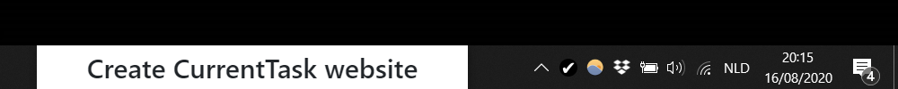
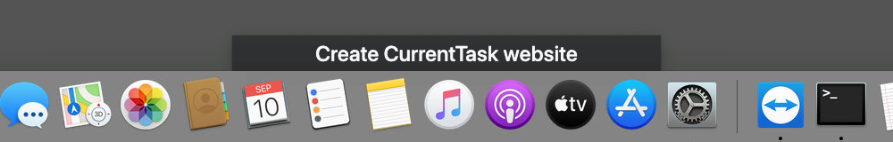

Project status:

-   🔧 In maintenance mode
    -   New features will not be added
    -   A best-effort attempt will be made to keep the current functionality working on Windows. The app will likely work on Mac as well.
    -   The underlying Electron version will not be upgraded as long as it doesn't prevent the app from working on Windows and it doesn't create a major security issue. Note that typical Electron vulnerabilities do not affect this app, since the app does not process arbitrary potentially-malicious third-party content (the only third-party content it processes comes from the official Todoist and Trello APIs). Known vulnerabilities currently used Electron version: https://snyk.io/test/npm/electron/10.2.0.
-   🔒 Not looking for code contributions from other developers

# CurrentTask

This is a desktop app that helps you to focus on one task at a time.

For more information about the app itself, please see [the website](https://current-task.mistermicheels.com/).

## Development

### Technology

The application is built using Electron. This allows using languages like JS, HTML and CSS that a lot of people are familiar with. It also makes it relatively easy to support multiple operating systems. Drawbacks are the relatively high memory use (compared to what you would expect from native code) and the fact that Electron has some bugs/limitations that we sometimes need to work around.

The application's code is bundled using Webpack. This affects the way pages are loaded into windows (using magic global variables provided by Electron Forge) as well as the way the pages load the JS, CSS and images they depend on (configured using `config.forge.plugins` in `package.json` and the top-level webpack configuration files). See also [Electron Forge Webpack documentation](https://www.electronforge.io/config/plugins/webpack).

### Running the app locally

It's recommended to install dependencies using `npm ci` to avoid any version mismatches.

You can run the app using `npm run start`, which will also generate the JSON Schema used to validate the advanced configuration file. If the schema is already there, you can choose to skip this schema generation step by running the app using `npm run start-no-generate`.

### Build scripts

The `prepare-make` script defines several checks that should pass for every commit that is made (enforced using a pre-commit hook defined by Husky):

-   Code should be formatted according to Prettier code style. This is easy to achieve by using VS Code and installing the recommended Prettier plugin as defined in `.vscode/extensions.json`. The `.vscode/settings.json` file configures VS Code to automatically format files on save. Make sure that you select Prettier as the formatter to use. Note that Prettier expects to find LF line endings and that the automatic formatting does not adjust line endings if needed.
-   Code should pass TypeScript type checking. If you use VS Code, it will notify you of errors as you code.
-   All of the unit tests should pass.

The `prepare-make` script also generates a fresh JSON Schema for the advanced configuration file. This is used by the unit tests and is also included with the finished application.

The `make-windows` and `make-mac` scripts are platform-specific scripts that take care of building the application. They are run on every push using GitHub actions. The resulting installers are made available as artifacts.

### Branches

Development happens on the `master` branch. There is also a `deployed_website` branch that holds the currently deployed website (see below).

### Versioning

This project uses [semantic versioning](https://semver.org/) in the following way:

-   PATCH version increase for releases containing just bug fixes
-   MINOR version increase for new features
-   MAJOR version increase for breaking changes, where we define a breaking change as something that does not allow (some) users to upgrade to the new version by simply removing the old one and installing the new one. An example of this would be a change in the location of the internal configuration file or a non-backwards-compatible change in the advanced configuration file structure. Note that functional changes are not considered to be breaking, although we will try to avoid changing behavior that users depend on.

### Website

The app's website is a static site generated using Eleventy and deployed using Netlify. The files for the website sit in the `_website` folder. You can locally generate the website (with automatic reload on changes) by running `npm run serve` in the `_website` folder.

During development, any related updates to the website should be made directly on the `master` branch. This way, the state of the website on `master` directly matches the code on `master`. The changes made on `master` will only be deployed to the actual website once they are merged into the `deployed_website` branch. This will normally happen when a new version is released. In case a change is relevant to the current version as well, it can be cherry-picked from `master` to `deployed_website`.

## Contributing

If you want to contribute to the development of this application, please review the [contributing guidelines](./CONTRIBUTING.md).
