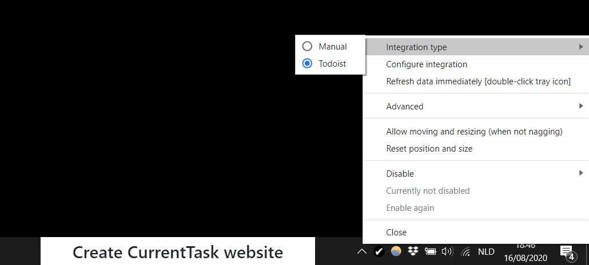
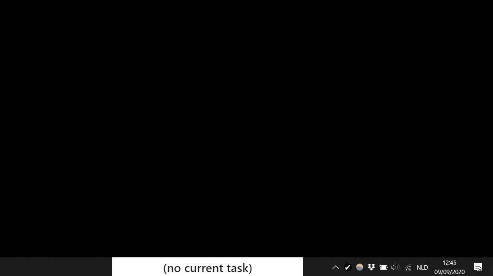
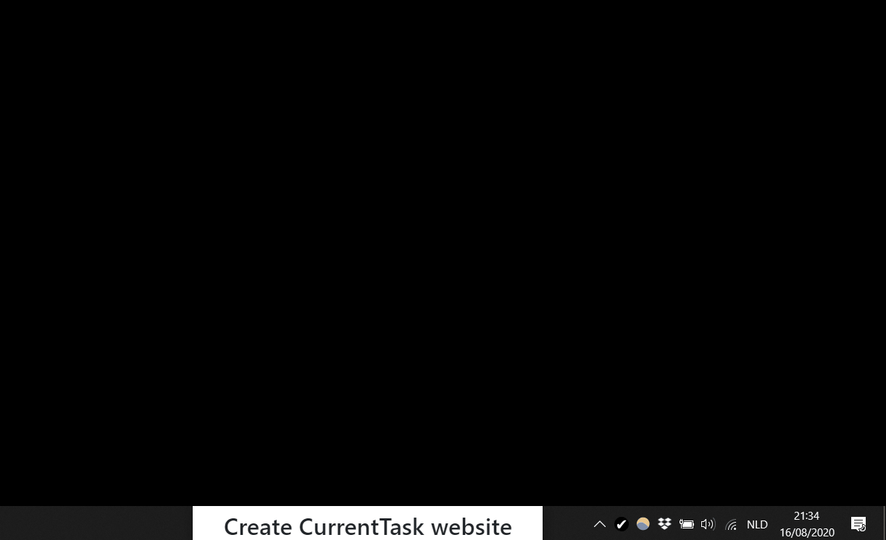
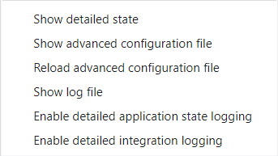
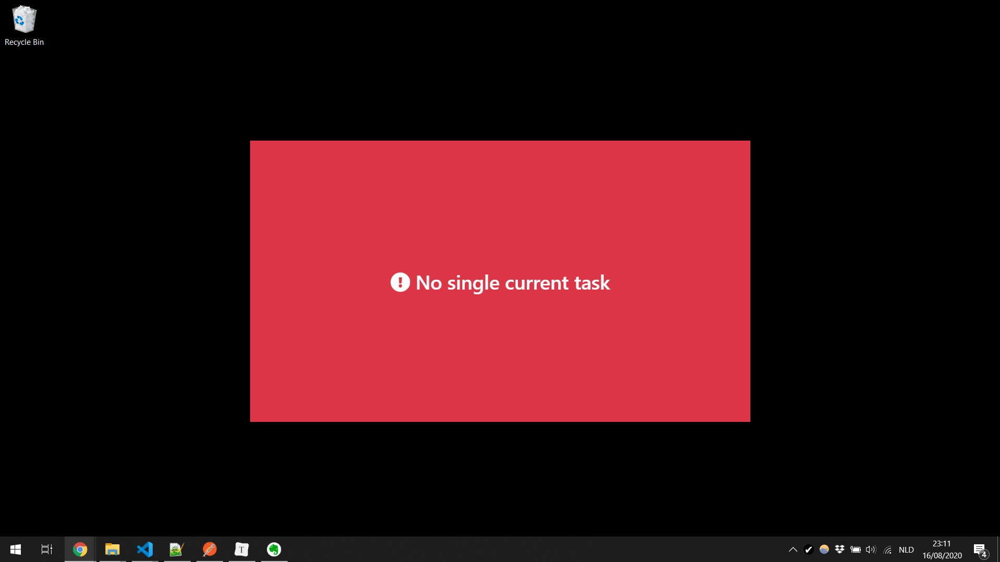
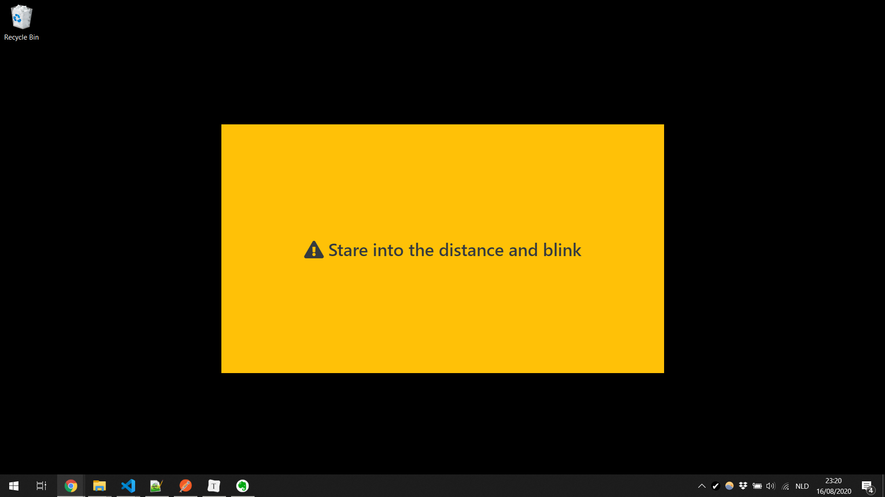

TOC_PLACEHOLDER

# Main features

-   Constantly shows you the current task you should be working on
    -   Sits in the taskbar by default, but can be moved if desired
-   Can be used standalone
-   Can integrate with Todoist
    -   _Note: This application is not created by, affiliated with, or supported by Doist_
-   Can be temporarily disabled
-   Highly customizable behavior through advanced configuration
    -   Require a reason for disabling (can help with willpower)
    -   Prevent closing from the system tray (can help with willpower)
    -   Custom messages based on the current state
    -   Configurable nagging or downtime mode based on the current state
    -   Example use case: making the app nag you about looking into the distance for 20 seconds every 20 minutes
    -   Example use case: making the app remind you that you're not supposed to be working after 19:00, except if you have scheduled a task for a specific time



# Integrations

## Manual mode

In manual mode, you can manually set/remove the current task. This mode does not depend on any external services.



## Todoist integration

_Note: This application is not created by, affiliated with, or supported by Doist._

The app can get your current task from Todoist, based on a label that you specify. In order to enable Todoist integration, select _Todoist_ under _Integration type_. Then, choose _Configure integration_ to enter the necessary data.

The app needs a token in order to access Todoist on your behalf. Do not share this token with anyone. Your token is stored in an encrypted configuration file and the encryption key is stored in your system's keychain.

Note that it may take a few seconds for the app to catch up on the latest changes. The app checks Todoist every few seconds, and the information it gets back might also be slighty outdated.


# Moving and resizing

If you enable moving and resizing, you can move the app window around and resize it to fit your needs.


# Disabling

You can temporarily disable the app through the tray menu, for example if you need to share your screen and don't like others to see the app.

If you want to disable the app on a fixed schedule, you might be better off configuring downtime conditions in advanced configuration (see below).



# Advanced

## Advanced menu

The _Advanced_ menu allows you to see some more detailed information about the app's current state. It also allows you to view the advanced configuration file and the logging file.



## Advanced configuration file

The advanced configuration file is a powerful way to customize the behavior of the app. The file uses the JSON format, which you might not be familiar with if you're not a software developer. Still, the examples below can go a long way in getting you up to speed.

The file is loaded when the app starts. If something is wrong, the app will present an error and fail to start. In case the file does not contain valid JSON to begin with, the app will show a generic error message (there are online JSON validators which might help you correct the issue). Otherwise, the app will show specific messages about anything it doesn't expect to see in the file.

If you find yourself unable to correct your advanced configuration file and simply want to start from scratch, it is sufficient to delete the advanced configuration file and restart the app. The app will create a valid JSON file containing no specific configuration.

### Basic options

-   `requireReasonForDisabling`: Don't allow disabling the app without specifying a reason
-   `forbidClosingFromTray`: Don't allow closing the app from the tray menu (in case of emergency, you can still kill the app from Task Manager)

Example simple configuration file:

```
{
    "requireReasonForDisabling": true,
    "forbidClosingFromTray": true
}
```

### Conditions

The most flexible configuration options all depend on conditions. These conditions allow you to specify when certain things should happen, based on the information available in the app's internal state.

To get an idea what the app's internal state looks like, you can choose _Show detailed state_ from the _Advanced_ menu.

Note that a condition by itself is not a valid configuration file. However, conditions are important building blocks for the most advanced configuration options.

#### Conditions dealing with numerical values

The following numerical values can be used in conditions:

-   `dayOfWeek`: The day of the week (Sunday is 0, Monday is 1, Saturday is 6)
-   `hours`: Hours of the current local time (24-hour clock)
-   `minutes`: Minutes of the current local time
-   `seconds`: Seconds of the current local time
-   `numberOverdueWithTime`: The number of overdue tasks scheduled for a specific time
-   `numberOverdueWithTimeMarkedCurrent`: The number of overdue tasks scheduled for a specific time that are marked as current task
-   `numberOverdueWithTimeNotMarkedCurrent`: The number of overdue tasks scheduled for a specific time that are not marked as current task
-   `numberMarkedCurrent`: The number of tasks that are marked as current task

Numerical values can be matched exactly by a condition, but it's also possible to match them in more flexible ways.

Example condition with numerical values:

```
{
    "dayOfWeek": 0,
    "hours": { "multipleOf": 2 },
    "minutes": { "anyOf": [0, 20, 40, 50] },
    "seconds": { "fromUntil": [0, 30] },
    "numberOverdueWithTime": { "lessThan": 2 },
    "numberMarkedCurrent": { "moreThan": 3 }
}
```

#### Other conditions

The values below can be used in a condition by matching them exactly

-   `currentTaskHasDate`: Whether or not the current task has a specified due date
-   `currentTaskHasTime`: Whether or not the current task has a specified due time
-   `currentTaskIsOverdue`: Whether or not the current task is overdue
-   `status`: The current status (ok, warning or error)

Example condition:

```
{
    "currentTaskHasDate": true,
    "currentTaskHasTime": false,
    "status": "ok"
}
```

#### Combining conditions

There are a few ways of combining conditions:

-   If you use multiple values in a condition, they must all match the app's state for the entire condition to match the app's state
-   You can use `not` to specify a condition that should not match
-   You can use `or` to specify multiple conditions where only one of them needs to match

Example of a combined condition:

```
{
    "status": "ok",
    "or": [
        { "hours": { "fromUntil": [20, 8] } },
        { "minutes": { "lessThan": 10 } }
    ],
    "not": {
        "currentTaskHasTime": true,
        "currentTaskIsOverdue": true
    }
}
```

This condition matches if the current status is "ok" **and** it's either between 20:00 and 08:00 or we're within the first 10 minutes of the hour **and** the current task is not both scheduled for a specific time and overdue.

### Custom state rules

Custom state rules allow you to set a specific state and message based on a condition. In your message, it's also possible to refer to properties of the app's internal state.

Example configuration file with custom state rules:

```
{
    "customStateRules": [
        {
            "condition": {
                "hours": { "fromUntil": [20, 8] },
                "not": {
                    "numberMarkedCurrent": 1
                }
            },
            "resultingStatus": "error",
            "resultingMessage": "The workday is over"
        },
        {
            "condition": {
                "hours": { "fromUntil": [20, 8] },
                "numberMarkedCurrent": 1
            },
            "resultingStatus": "warning",
            "resultingMessage": "%{currentTaskTitle} will have to wait until tomorrow"
        }
    ]
}
```

### Nagging and downtime conditions

You can use conditions to trigger two properties of the app:

-   Nagging mode: If enabled, the app windows sits in the middle of your screen and takes up a large portion of the available screen space
-   Downtime mode: If enabled, the app will be hidden

Example configuration file using nagging and downtime conditions:

```
{
    "naggingConditions": [
        {
            "numberMarkedCurrent": { "moreThan": 1 }
        }
    ],
    "downtimeConditions": [
        {
            "numberMarkedCurrent": 0
        }
    ]
}
```

This configuration file will make the app nag you if there is more than one task marked current, but it will disappear if there are no tasks marked current.

### Example complete configuration files

#### Nag with an error if there is not exactly one scheduled task

```
{
    "requireReasonForDisabling": true,
    "forbidClosingFromTray": true,
    "customStateRules": [
        {
            "condition": {
                "not": {
                    "numberMarkedCurrent": 1
                }
            },
            "resultingStatus": "error",
            "resultingMessage": "No single current task"
        }
    ],
    "naggingConditions": [
        {
            "status": "error"
        }
    ]
}
```



#### Eye breaks

```
{
    "customStateRules": [
        {
            "condition": {
                "minutes": { "multipleOf": 20 },
                "seconds": { "fromUntil": [0, 20] }
            },
            "resultingStatus": "warning",
            "resultingMessage": "Stare into the distance and blink"
        }
    ],
    "naggingConditions": [
        {
            "status": "warning"
        }
    ]
}
```



#### Only specifically scheduled work after 20:00

```
{
    "customStateRules": [
        {
            "condition": {
                "hours": { "fromUntil": [20, 8] },
                "not": {
                    "currentTaskHasTime": true,
                    "currentTaskIsOverdue": true
                }
            },
            "resultingStatus": "error",
            "resultingMessage": "Only specifically scheduled work after 20:00"
        }
    ],
    "naggingConditions": [
        {
            "status": "error"
        }
    ]
}
```

## Logs

By default, only exceptional events (like a failing call to Todoist) get logged. If you turn on detailed logging from the _Advanced_ menu, the logs will contain more detailed information about what the app is doing.
