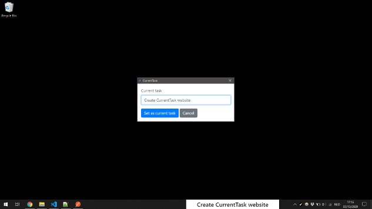
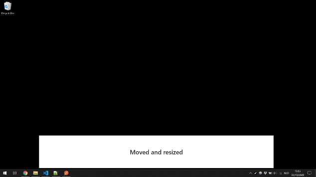
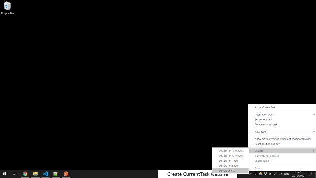
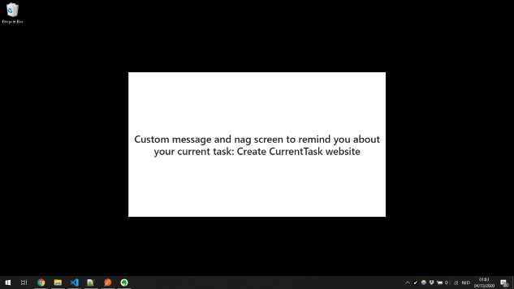
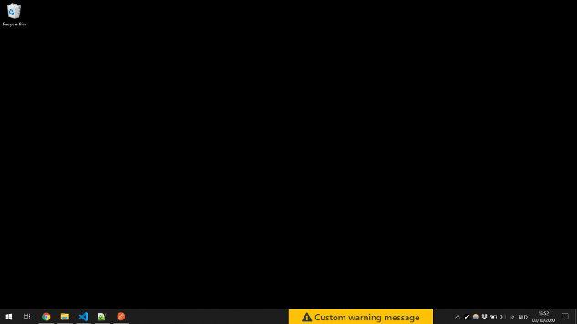
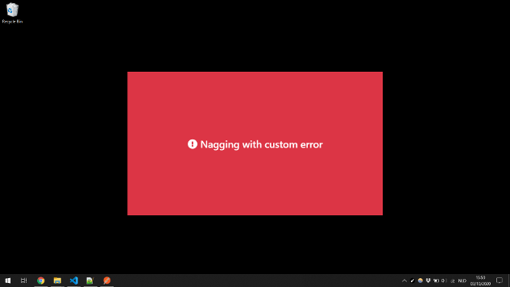
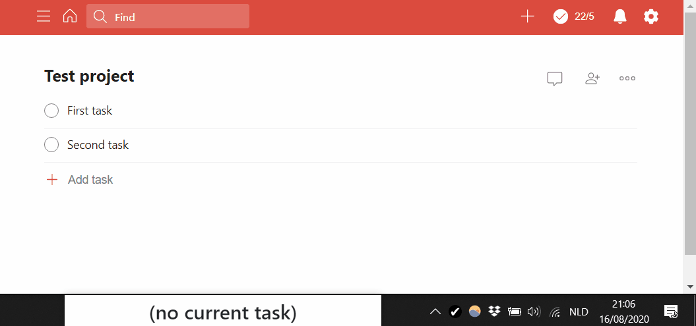
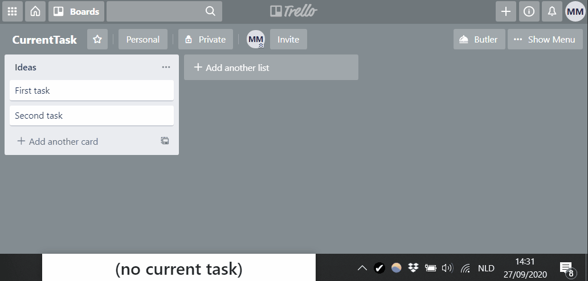
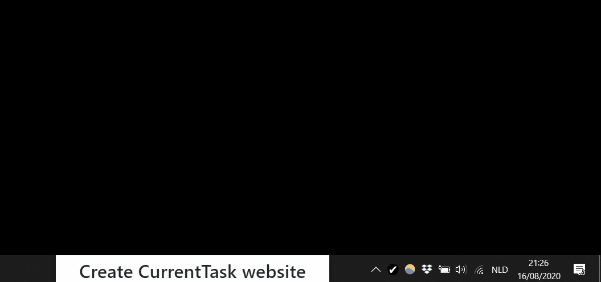

-   **Shows the current task** you should be working on
    -   On Windows, it sits on top of the taskbar by default
    -   On Mac, it sits just above the Dock by default
    -   Can be moved and resized based on your needs
    -   Can be temporarily disabled
-   Can be used **standalone** but can also integrate with **Todoist** or **Trello**
-   Highly **customizable** behavior through advanced configuration
    -   Custom messages and status (ok/warning/error) based on the current state
    -   Configurable nagging, blinking and downtime mode based on the current state
    -   _Example: making the app nag you when you haven't set exactly one current task_
    -   _Example: making the app remind you to take breaks_
    -   _Example: making the app draw your attention to the current task every few minutes_
-   **Free and open source**, code is available on [GitHub](https://github.com/mistermicheels/current-task)

[Screenshots](#screenshots) | [Downloads](#downloads) | [Documentation](#documentation) | [License](#license)

# Screenshots

Default behavior:

<div class="screenshots-gallery">
    <a href="./img/screenshots/gallery/current-task-dialog.png">
        
    </a>
    <a href="./img/screenshots/gallery/moved-resized.png">
        
    </a>
    <a href="./img/screenshots/gallery/disable-menu.png">
        
    </a>
</div>

Custom behavior through advanced configuration:

<div class="screenshots-gallery">
    <a href="./img/screenshots/gallery/nag-ok.png">
        
    </a>
    <a href="./img/screenshots/gallery/custom-warning.png">
        
    </a>
    <a href="./img/screenshots/gallery/nag-custom-error.png">
        
    </a>
</div>

# Downloads

Current version: {{ current_version }} (for a history of releases and details regarding what they include, take a look at the [GitHub releases page](https://github.com/mistermicheels/current-task/releases))

-   Windows:
    -   [MSI installer](https://github.com/mistermicheels/current-task/releases/download/v{{ current_version }}/CurrentTask-{{ current_version }}.msi)
    -   [Zip file](https://github.com/mistermicheels/current-task/releases/download/v{{ current_version }}/CurrentTask-{{ current_version }}.zip)
-   Mac:
    -   [DMG installer](https://github.com/mistermicheels/current-task/releases/download/v{{ current_version }}/CurrentTask-{{ current_version }}.dmg)

For installation instructions, see [Installing and upgrading](#installing-and-upgrading)

# Documentation

<!--
    Table of contents will be automatically generated and inserted here.
    The table of contents should only include titles within the Documentation part.
    This is currently accomplished by configuring markdown-it-toc-done-right to omit top-level headings.
    We will need to revisit this if we need subheadings in other sections as wel.
-->

TOC_PLACEHOLDER

## Installing and upgrading

### Installing the application

General instructions:

-   Windows:
    -   MSI installer: Requires administrator access. The application will show up in the list of installed applications and will be added to the Start menu.
    -   Zip file: Extract the contents of the file to your location of choice, then double-click _CurrentTask.exe_ to open the app.
-   Mac:
    -   DMG installer: Install the app by dragging it into the Applications folder. If you don't have the necessary permissions for that, you can also drag the app somewhere else (for example, your desktop).

Currently, the app is not certified with Microsoft or Apple. This means that, when trying to install the app or run it for the first time, you might get a warning about the app potentially being unsafe. The way to circumvent this depends on your system:

-   Windows: At the bottom of the _Windows protected your PC_ dialog, choose _Run anyway_. You might have to click _more info_ below the dialog text in order for that option to show up.
-   Mac: Locate the application in Finder. Control-click the app icon and choose _Open_ from the shortcut menu. In the dialog that opens, choose _Open_.

### Upgrading to a newer version

Because the app is not certified with Microsoft or Apple, automatic updates are not possible for now. The recommended way to upgrade to a newer version is to close the app, uninstall/delete the old version and then install the new one. Your configuration will be preserved.

There are a few ways to get notified about new releases:

-   If you have a GitHub account (you can easily create one for free), you can watch the [GitHub repository](https://github.com/mistermicheels/current-task) in "Releases only" mode
-   New releases are also announced on [Twitter](https://twitter.com/mistermicheels) (drawback is that these announcements might get buried in your feed and that not all tweets are relevant to CurrentTask)

## Integrations

### Manual mode

In manual mode, you can manually set/remove the current task. This mode does not depend on any external services.

To set the current task, choose _Set current task ..._ in the tray icon menu. To remove the current task, choose _Remove current task_

### Todoist integration



_Note: This application is not created by, affiliated with, or supported by Doist._

The app can get your current task from Todoist, based on a label that you specify. In order to enable Todoist integration, select _Todoist_ under _Integration type_ in the tray icon menu. Then, choose _Configure integration_ to enter the necessary data.

The app needs a token in order to access Todoist on your behalf. Do not share this token with anyone. Your token is stored in an encrypted configuration file and the encryption key is stored in your system's keychain.

By default, the app ignores tasks that are scheduled for a specific date in the future and it will periodically remove your configured label from such tasks. This is useful in case of recurring tasks, as you probably don't want them to stay marked as "current task" after you complete them. You can change this behavior by configuring the app to include tasks scheduled for a date in the future. In that case, the app will also not remove the label from them.

Note that it may take a few seconds for the app to catch up on the latest changes. The app checks Todoist every few seconds, and the information it gets back might also be slightly outdated. Additionally, due to the way the integration works, it is possible to lose changes you make to a task's labels if you happen to make those changes while the app is removing your "current task" label from the task. This can happen if you let the app automatically remove the label from tasks scheduled for the future or if you used advanced configuration to make the app automatically clear the current task(s). This only affects the _labels_ of the _tasks you mark current_; the app never tries to change anything else.

### Trello integration



The app can get your current task from Trello, based on a label name that you specify. In order to enable Trello integration, select _Trello_ under _Integration type_ in the tray icon menu. Then, choose _Configure integration_ to enter the necessary data.

The app needs an API key and token in order to access Trello on your behalf. Do not share the token with anyone. Your token is stored in an encrypted configuration file and the encryption key is stored in your system's keychain.

Note that it may take a few seconds for the app to catch up on the latest changes. The app checks Trello every few seconds, and the information it gets back might also be slightly outdated.

## Moving and resizing

If you enable moving and resizing, you can move the app window around and resize it to fit your needs. If you are using advanced configuration (see below) to make the app nag or blink, note that moving and resizing will not be possible when the app is in nagging or blinking mode.



## Disabling

You can temporarily disable the app through the tray menu, for example if you need to share your screen and don't like others to see the app. The tray icon and its tooltip will indicate the disabled state.

The _Disable_ menu provides a few options for quickly disabling the app for a fixed amount of time, without needing to specify a reason.

Additionally, you can choose _Disable until ..._ to disable the app until a specific time for a particular reason. It is possible to make this reason required through the advanced configuration file (see below). In that case, the menu options for quickly disabling the app without specifying a reason will be disabled.

Note: If you want to disable the app on a fixed schedule, you might be better off configuring downtime conditions in advanced configuration (see below).

## Advanced

### Advanced menu

The _Advanced_ menu allows you to see some more detailed information about the app's current state and to view and reload the advanced configuration file. It also allows you to view the log file and enable or disable detailed logging regarding state calculation and integration functionality.

### Advanced configuration file

The advanced configuration file is a powerful way to customize the behavior of the app. The file uses the JSON format, which you might not be familiar with if you're not a software developer. Still, the examples below can go a long way in getting you up to speed.

The file is loaded when the app starts. If something is wrong, the app will present an error and fail to start. In case the file does not contain valid JSON to begin with, the app will show a generic error message (there are online JSON validators which might help you correct the issue). Otherwise, the app will show specific messages about anything it doesn't expect to see in the file.

If you find yourself unable to correct your advanced configuration file and you simply want to start from scratch, it is sufficient to delete the advanced configuration file and restart the app. The app will create a valid JSON file without any specific configuration.

When editing the advanced configuration file, you can choose _Reload advanced configuration file_ from the _Advanced_ menu in order to apply your changes immediately. If you make a mistake and put invalid data in the advanced configuration file, you will get an error like the one you would get when the application starts.

#### Basic options

-   `requireReasonForDisabling`: Don't allow disabling the app without specifying a reason
-   `forbidClosingFromTray`: Don't allow closing the app from the tray menu (in case of emergency, you can still kill the app from Task Manager on Windows or through Force Quit on Mac)
-   `resetStateTimersIfSystemIdleForSeconds`: Reset state timers (`secondsInCurrentStatus` and `secondsSinceOkStatus`, see below) if the system has been idle for at least the specified number of seconds. If 0 or not specified, state timers will not be reset based on system idle time.
-   `clearCurrentIfSystemIdleForSeconds`: Clear current task(s) if the system has been idle for at least the specified number of seconds. If 0 or not specified, current task(s) will not be cleared based on system idle time.
-   `clearCurrentIfDisabled`: Clear current task(s) if the app is disabled (or in downtime mode, see [Nagging, blinking and downtime conditions](#nagging%2C-blinking-and-downtime-conditions)).

Note that current task(s) will not be cleared more than once every 10 seconds if using Todoist or Trello integration.

Example simple configuration file:

```
{
    "requireReasonForDisabling": true,
    "forbidClosingFromTray": true,
    "resetStateTimersIfSystemIdleForSeconds": 120,
    "clearCurrentIfSystemIdleForSeconds": 300,
    "clearCurrentIfDisabled": true
}
```

#### Conditions

The most flexible configuration options all depend on conditions. These conditions allow you to specify when certain things should happen, based on the information available in the app's internal state.

To get an idea what of the app's internal state looks like, you can choose _Show calculated state_ from the _Advanced_ menu. Note that properties related to task date, task time and overdue tasks are not very useful in manual mode because they rely on data that only proper integrations can provide.

A condition by itself is not a valid configuration file. However, conditions are important building blocks that are used by several kinds of advanced configuration.

##### Conditions dealing with numerical values

The following numerical values can be used in conditions:

-   `dayOfWeek`: The day of the week (Sunday is 0, Monday is 1, Saturday is 6)
-   `hours`: Hours of the current local time (24-hour clock)
-   `minutes`: Minutes of the current local time
-   `seconds`: Seconds of the current local time
-   `numberMarkedCurrent`: The number of tasks that are marked as current task
-   `numberOverdue`: The number of overdue tasks
-   `numberOverdueMarkedCurrent`: The number of overdue tasks that are marked as current task
-   `numberOverdueNotMarkedCurrent`: The number of overdue tasks that are not marked as current task
-   `numberOverdueWithTime`: The number of overdue tasks scheduled for a specific time
-   `numberOverdueWithTimeMarkedCurrent`: The number of overdue tasks scheduled for a specific time that are marked as current task
-   `numberOverdueWithTimeNotMarkedCurrent`: The number of overdue tasks scheduled for a specific time that are not marked as current task
-   `numberScheduledForToday`: The number of tasks scheduled for today
-   `numberScheduledForTodayMarkedCurrent`: The number of tasks scheduled for today that are marked as current task
-   `numberScheduledForTodayNotMarkedCurrent`: The number of tasks scheduled for today that are not marked as current task
-   `secondsInCurrentStatus`: The number of seconds that the app has been in the current status (starts from the last status change, will stay at 0 if the app is disabled or in downtime mode or if the system has been sleeping/hibernating/... for at least a minute)
-   `secondsSinceOkStatus`: The number of seconds since the app had the "ok" status (will stay at 0 if the app is disabled or in downtime mode or if the system has been sleeping/hibernating/... for at least a minute)

Numerical values can be matched exactly by a condition, but you can also match them in more flexible ways using operators like `fromUntil`, `lessThan`, ....

Examples of the ways you can match numerical values:

```
{
    "dayOfWeek": 0,
    "hours": { "multipleOf": 2 },
    "minutes": { "anyOf": [0, 20, 40, 50] },
    "seconds": { "fromUntil": [0, 30] },
    "numberOverdueWithTime": { "lessThan": 2 },
    "numberMarkedCurrent": { "moreThan": 3 }
}
```

Note: `{ "fromUntil": [a, b] }` matches values from `a` to `b`, including `a` but not including `b`. It also allows `a` to be larger than `b`, in that case it matches values that are either at least as large as `a` or smaller than `b`. This is especially useful when dealing with hours, minutes and seconds. For example, `{ "hours": { "fromUntil": [8, 16] } }` starts matching at 08:00 and stops matching at 16:00. Also, `{ "hours": { "fromUntil": [20, 8] } }` starts matching at 20:00 and stops matching at 08:00.

You can also combine multiple operators when matching a single numerical value. Example:

```
{
   "seconds": { "fromUntil": [0, 30], "multipleOf": 2 }
}
```

The condition above matches if we're in the first half of the minute and the number of seconds is a multiple of 2.

##### Other conditions

The values below can be used in a condition by matching them exactly

-   `currentTaskHasDate`: Whether or not the current task has a specified due date
-   `currentTaskHasTime`: Whether or not the current task has a specified due time
-   `currentTaskIsOverdue`: Whether or not the current task is overdue
-   `currentTaskIsScheduledForToday`: Whether or not the current task is scheduled for today
-   `status`: The current status (ok/warning/error)

Example condition:

```
{
    "currentTaskHasDate": true,
    "currentTaskHasTime": false,
    "status": "ok"
}
```

##### Combining conditions

There are a few ways of combining conditions:

-   If you use multiple values in a condition, they must all match the app's state in order for the entire condition to match the app's state (the condition above is an example of this)
-   You can use `not` to specify a condition that should not match
-   You can use `or` to specify multiple conditions where only one of them needs to match
-   You can use `and` to specify multiple conditions where all of them need to match

Example of a combined condition:

```
{
    "status": "ok",
    "or": [
        { "hours": { "fromUntil": [20, 8] } },
        { "minutes": { "lessThan": 10 } }
    ],
    "not": {
        "currentTaskHasTime": true,
        "currentTaskIsOverdue": true
    }
}
```

The condition above matches if the current status is "ok" **and** it's either between 20:00 and 08:00 or we're within the first 10 minutes of the hour **and** the current task is not both scheduled for a specific time and overdue.

As you can see from the example above, you don't necessarily need to use `and` to specify that multiple things need to be true for the condition to match. However, you do need `and` if you want to specify multiple conditions that should all match and that all use the same operator on the same numerical value. Example:

```
{
    "and": [
        { "seconds": { "multipleOf": 2 } },
        { "seconds": { "multipleOf": 3 } }
    ]
}
```

#### Custom state rules

Custom state rules allow you to set a specific status (ok/warning/error) and message based on a condition. In your message, it's also possible to refer to properties of the app's internal state.

Example configuration file with custom state rules:

```
{
    "customStateRules": [
        {
            "condition": {
                "hours": { "fromUntil": [20, 8] },
                "not": {
                    "numberMarkedCurrent": 1
                }
            },
            "resultingStatus": "error",
            "resultingMessage": "The workday is over"
        },
        {
            "condition": {
                "hours": { "fromUntil": [20, 8] },
                "numberMarkedCurrent": 1
            },
            "resultingStatus": "warning",
            "resultingMessage": "%{currentTaskTitle} will have to wait until tomorrow"
        }
    ]
}
```

Every second, the app will check the conditions for the rules and it will use the first matching rule that it finds. If no matching rules are found, the app falls back to the default behavior.

Note that values related to status (`status`, `secondsInCurrentStatus` and `secondsSinceOkStatus`) will have placeholder values when applying custom state rules. Therefore, it doesn't make sense to use them in custom state rule conditions.

Next to `resultingStatus` and `resultingMessage`, you can also specify `clearCurrent` on a rule. If the first matching rule has `"clearCurrent": true`, the current task(s) will be cleared. Note that current task(s) will not be cleared more than once every 10 seconds if using Todoist or Trello integration.

If your custom state rules don't work the way you would expect, you can enable detailed state calculation logging and check the log file for more details. Note that this makes your log file grow very fast, so it's probably not a good idea to enable it for longer than necessary. See also [Logs](#logs).

#### Nagging, blinking and downtime conditions

You can use conditions to trigger three properties of the app:

-   Nagging mode: If enabled, the app windows sits in the middle of your screen and takes up a large portion of the available screen space
-   Blinking mode: If enabled, the app window blinks to catch your attention (only if not nagging)
-   Downtime mode: If enabled, the app will be hidden (same effect as disabling, nagging and blinking are ignored in this case)

Example configuration file using nagging, blinking and downtime conditions:

```
{
    "naggingConditions": [
        {
            "numberMarkedCurrent": { "moreThan": 1 }
        }
    ],
    "downtimeConditions": [
        {
            "numberMarkedCurrent": 0
        }
    ],
    "blinkingConditions": [
        {
            "minutes": { "multipleOf": 5 },
            "seconds": { "fromUntil": [0, 10] }
        }
    ]
}
```

This configuration file will make the app nag you if there is more than one task marked current, but it will disappear if there are no tasks marked current. Additionally, it will blink for 10 seconds every 5 minutes (if not in downtime mode at the time).

If your nagging, blinking and downtime conditions don't work the way you would expect, you can enable detailed state calculation logging and check the log file for more details. Note that this makes your log file grow very fast, so it's probably not a good idea to enable it for longer than necessary. See also [Logs](#logs).

#### Example complete configuration files

##### Show error if no single current task, start nagging after 60 seconds, reset if idle for 5 minutes

```
{
    "resetStateTimersIfSystemIdleForSeconds": 300,
    "customStateRules": [
        {
            "condition": {
                "not": {
                    "numberMarkedCurrent": 1
                }
            },
            "resultingStatus": "error",
            "resultingMessage": "No single current task"
        }
    ],
    "naggingConditions": [
        {
            "secondsSinceOkStatus": { "moreThan": 60 }
        }
    ]
}
```

##### Eye breaks

```
{
    "customStateRules": [
        {
            "condition": {
                "minutes": { "multipleOf": 20 },
                "seconds": { "fromUntil": [0, 20] }
            },
            "resultingStatus": "warning",
            "resultingMessage": "Stare into the distance and blink"
        }
    ],
    "naggingConditions": [
        {
            "status": "warning"
        }
    ]
}
```

##### Break every 30 minutes, clear current task when break starts

```
{
    "customStateRules": [
        {
            "condition": {
                "or": [
                    { "minutes": { "fromUntil": [25, 30] } },
                    { "minutes": { "fromUntil": [55, 0] } }
                ]
            },
            "resultingStatus": "warning",
            "resultingMessage": "Sitting break",
            "clearCurrent": true
        }
    ],
    "naggingConditions": [
        {
            "status": "warning"
        }
    ]
}
```

##### Draw attention to current task every 5 minutes, either by nagging or blinking

```
{
    "naggingConditions": [
        {
            "minutes": { "multipleOf": 30 },
            "seconds": { "fromUntil": [0, 10] }
        }
    ],
    "blinkingConditions": [
        {
            "minutes": { "multipleOf": 5 },
            "seconds": { "fromUntil": [0, 10] }
        }
    ]
}
```

Note that blinking is automatically disabled when the app is nagging.

##### Hide the app during the weekend

```
{
    "downtimeConditions": [
        {
            "dayOfWeek": { "anyOf": [0, 6] }
        }
    ]
}
```

##### Warning when missing start of scheduled task

```
{
    "customStateRules": [
        {
            "condition": {
                "numberOverdueWithTimeNotMarkedCurrent": { "moreThan": 0 }
            },
            "resultingStatus": "warning",
            "resultingMessage": "Scheduled task"
        }
    ]
}
```

##### Only specifically scheduled work after 20:00

```
{
    "customStateRules": [
        {
            "condition": {
                "hours": { "fromUntil": [20, 8] },
                "not": {
                    "currentTaskHasTime": true,
                    "currentTaskIsOverdue": true
                }
            },
            "resultingStatus": "error",
            "resultingMessage": "Only specifically scheduled work after 20:00"
        }
    ]
}
```

### Logs

You can view the application's log file from the _Advanced_ menu. By default, the app logs only the most important things that happen.

The _Advanced_ menu also has options to enable detailed logging. Detailed logging will log a lot more information regarding the integration functionality as well as the application of custom state rules and nagging/blinking/downtime conditions from the advanced configuration file (depending on what you enable). This can be useful for debugging purposes in case things don't seem to be working as expected. However, detailed logging will make the log file grow very fast. Therefore, detailed logging should only be turned on when investigating something that doesn't seem right and it should be turned off again as soon as you have sufficient information. It might make sense to enable detailed logging for a few seconds and then turn it off again _before_ you start investigating the contents of the log file.

# License

> MIT License
>
> Copyright (c) 2020 mistermicheels
>
> Permission is hereby granted, free of charge, to any person obtaining a copy
> of this software and associated documentation files (the "Software"), to deal
> in the Software without restriction, including without limitation the rights
> to use, copy, modify, merge, publish, distribute, sublicense, and/or sell
> copies of the Software, and to permit persons to whom the Software is
> furnished to do so, subject to the following conditions:
>
> The above copyright notice and this permission notice shall be included in all
> copies or substantial portions of the Software.
>
> THE SOFTWARE IS PROVIDED "AS IS", WITHOUT WARRANTY OF ANY KIND, EXPRESS OR
> IMPLIED, INCLUDING BUT NOT LIMITED TO THE WARRANTIES OF MERCHANTABILITY,
> FITNESS FOR A PARTICULAR PURPOSE AND NONINFRINGEMENT. IN NO EVENT SHALL THE
> AUTHORS OR COPYRIGHT HOLDERS BE LIABLE FOR ANY CLAIM, DAMAGES OR OTHER
> LIABILITY, WHETHER IN AN ACTION OF CONTRACT, TORT OR OTHERWISE, ARISING FROM,
> OUT OF OR IN CONNECTION WITH THE SOFTWARE OR THE USE OR OTHER DEALINGS IN THE
> SOFTWARE.
